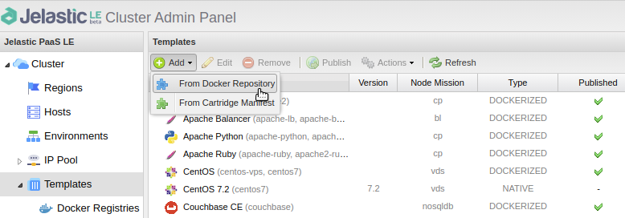
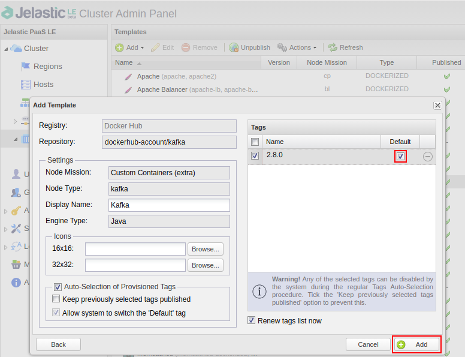
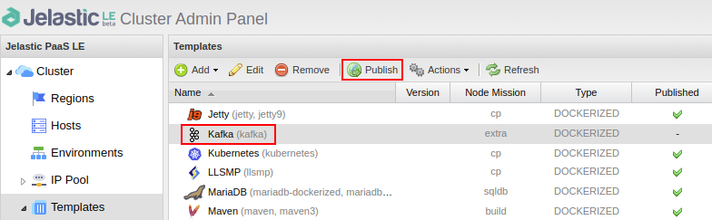
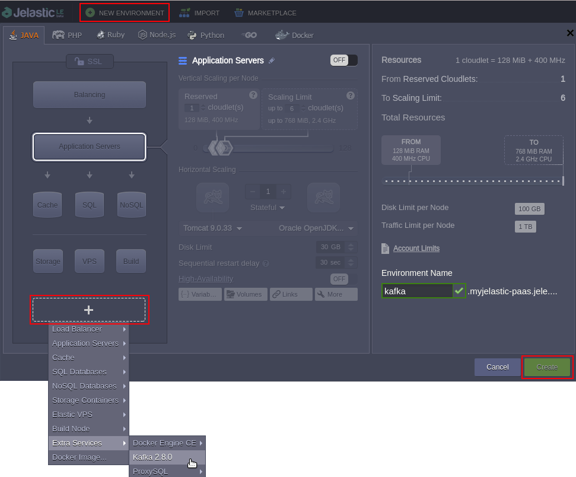

# Kafka Custom Image Building to be Published at Jelastic PaaS

With this repository you may build customized docker image of [Apache Kafka Broker](https://kafka.apache.org/) that can be published at any Jelastic PaaS as a custom template.
Here we use version 2.4.1 of Kafka.

## Docker Build and Push

Docker build and push operations you can do either localy or in Jelastic Cloud Platform of your Hosting Provider. Let's consider Jelastic PaaS.  

1. Sign in your [Jelastic account](https://jelastic.com/blog/docker-engine-automatic-install-swarm-connect/).
2. Install Docker Engine CE application from the [Marketplace]().
3. Open [WebSSH](https://docs.jelastic.com/web-ssh-client).
4. Clone this repository:
***git clone https://github.com/jelastic/kafka-image-building***
5. Change current directory to *kafka-image-building*: ***cd kafka-image-building***
6. Build image with name of your Docker Hub account:
***docker image build -t <dockerhub-account\>/kafka:2.4.1 .***
7. Push image to Docker Hub 
***docker image push <dockerhub-account\>/kafka:2.4.1***
8. Open [Jelastic Cluster Admin Panel](https://ops-docs.jelastic.com/jca-introduction), add created template **From Docker Hub Repository**

 

and choose required tag as default.  
  

 

Publish new template.

 

## Kafka Broker Testing

1. Create new environment with published Kafka 2.4.1.

 

2. Open WebSSH on Kafka node and clone this repository:
***git clone https://github.com/jelastic/kafka-image-building*** 
3. Change current directory to *kafka-image-building*:
***cd kafka-image-building***
4. Create topic called as *test-topic* with shell script: 
 ***sh new-topic.sh***
5. Run producer and write messages to the *test-topic*:
 ***sh producer.sh***
6. Run consumer to read messages from the topic:
  ***sh consumer.sh***
  
 You should see all the messages you sent and if so you may consider the broker is workable.
  